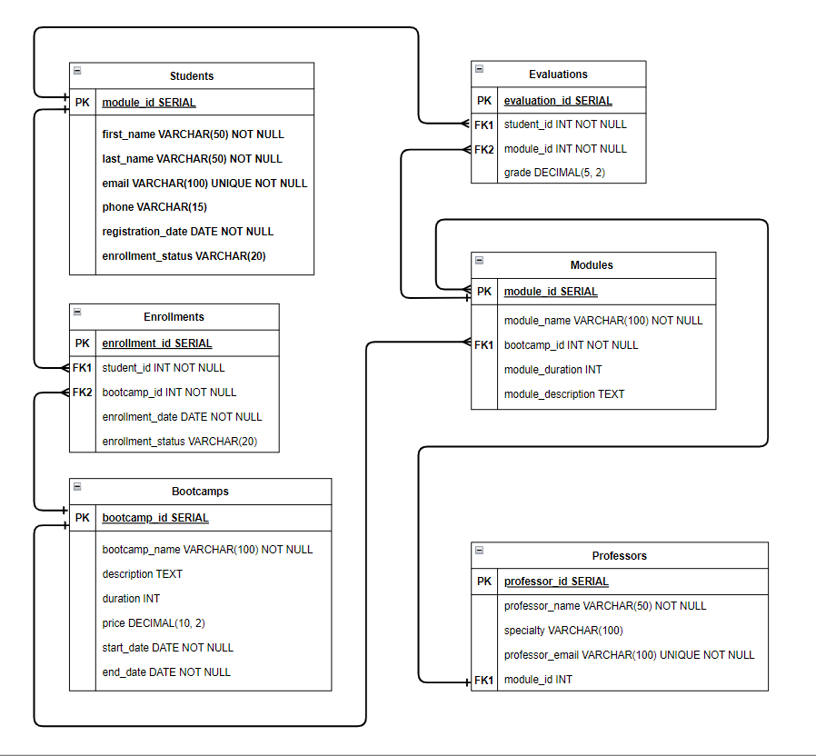

# PRÁCTICA SQL Y DW

## 1. DIAGRAMA ENTIDAD RELACIÓN
Realizar el diagrama entidad relación con el que poder modelar una base de datos para Keepcoding, es decir, recogiendo datos de alumnos, bootcamps, módulos, profesores...
Se debe entregar un .pdf con el diagrama y una pequeña explicación de este.



### Resumen de las Tablas:

**Students (Estudiantes):**  
Esta tabla almacena los datos de los estudiantes, incluyendo su identificación, nombre, correo electrónico, teléfono, fecha de registro y estado de inscripción.  
- Tiene una relación 1 con la tabla Enrollments, lo que significa que un estudiante puede estar inscrito en varios bootcamps (múltiples inscripciones).
- También tiene una relación 1 con Evaluations, ya que un estudiante puede tener múltiples evaluaciones.

**Bootcamps:**  
Aquí se almacena la información de los bootcamps, como su nombre, descripción, duración, precio y fechas de inicio y fin.  
- Tiene una relación 1 con la tabla Enrollments, indicando que varios estudiantes pueden inscribirse en un mismo bootcamp.
- Además, tiene una relación 1 con Modules, lo que significa que un bootcamp puede tener varios módulos asociados.

**Modules (Módulos):**  
Esta tabla almacena información sobre los módulos, como el nombre, duración y una descripción, además del identificador del bootcamp al que pertenecen.  
- Tiene una relación 1 con Professors, ya que un módulo es impartido por un profesor, pero un profesor puede estar asignado a múltiples módulos.
- También tiene una relación 1 con Evaluations, lo que indica que un módulo puede tener múltiples evaluaciones de diferentes estudiantes.

**Professors (Profesores):**  
La tabla de profesores contiene la información del profesorado, incluyendo el nombre, especialidad y correo electrónico.  
- Está relacionada con la tabla Modules mediante una relación 1, lo que significa que un profesor puede estar a cargo de varios módulos.

**Enrollments (Inscripciones):**  
Esta tabla representa las inscripciones de los estudiantes en los bootcamps. Contiene referencias al estudiante y al bootcamp en el que se ha inscrito, junto con la fecha de inscripción y el estado de la inscripción.  
- Tiene una relación N:1 con Students y Bootcamps, lo que indica que una inscripción pertenece a un estudiante y a un bootcamp en particular.

**Evaluations (Evaluaciones):**  
Esta tabla registra las evaluaciones de los estudiantes en los módulos. Cada evaluación está asociada a un estudiante y a un módulo en particular, e incluye la nota obtenida.  
- Tiene una relación 1 tanto con Students como con Modules, lo que significa que un estudiante puede tener múltiples evaluaciones en diferentes módulos, y un módulo puede tener evaluaciones de varios estudiantes.

### Resumen de Relaciones:

- **Students ↔ Enrollments:** Relación 1 (un estudiante puede tener varias inscripciones).
- **Bootcamps ↔ Enrollments:** Relación 1 (un bootcamp puede tener varios estudiantes inscritos).
- **Bootcamps ↔ Modules:** Relación 1 (un bootcamp puede tener varios módulos).
- **Modules ↔ Professors:** Relación 1 (un profesor puede enseñar varios módulos).
- **Students ↔ Evaluations:** Relación 1 (un estudiante puede tener varias evaluaciones).
- **Modules ↔ Evaluations:** Relación 1 (un módulo puede tener varias evaluaciones).

## 2. CREACIÓN DE BASE DE DATOS
Desarrollar un script para crear las tablas y las restricciones necesarias según el diagrama entregado en el punto anterior.  
El script debe poder ejecutarse en PostgreSQL. 
Se debe entregar un fichero con el código solicitado y extensión .sql.

```sql
DROP DATABASE IF EXISTS Test_Keepcoding_PostgreSQL;
CREATE DATABASE Test_Keepcoding_PostgreSQL;

CREATE TABLE Students (
    student_id SERIAL PRIMARY KEY,
    first_name VARCHAR(50) NOT NULL,
    last_name VARCHAR(50) NOT NULL,
    email VARCHAR(100) UNIQUE NOT NULL,
    phone VARCHAR(15),
    registration_date DATE NOT NULL,
    enrollment_status VARCHAR(20)
);

CREATE TABLE Bootcamps (
    bootcamp_id SERIAL PRIMARY KEY,
    bootcamp_name VARCHAR(100) NOT NULL,
    description TEXT,
    duration INT,
    price DECIMAL(10, 2),
    start_date DATE NOT NULL,
    end_date DATE NOT NULL
);

CREATE TABLE Modules (
    module_id SERIAL PRIMARY KEY,
    module_name VARCHAR(100) NOT NULL,
    bootcamp_id INT NOT NULL,
    module_duration INT,
    module_description TEXT,
    CONSTRAINT fk_bootcamp FOREIGN KEY (bootcamp_id) REFERENCES Bootcamps(bootcamp_id)
);

CREATE TABLE Professors (
    professor_id SERIAL PRIMARY KEY,
    professor_name VARCHAR(50) NOT NULL,
    specialty VARCHAR(100),
    professor_email VARCHAR(100) UNIQUE NOT NULL,
    module_id INT,
    CONSTRAINT fk_module FOREIGN KEY (module_id) REFERENCES Modules(module_id)
);

CREATE TABLE Enrollments (
    enrollment_id SERIAL PRIMARY KEY,
    student_id INT NOT NULL,
    bootcamp_id INT NOT NULL,
    enrollment_date DATE NOT NULL,
    enrollment_status VARCHAR(20),
    CONSTRAINT fk_student FOREIGN KEY (student_id) REFERENCES Students(student_id),
    CONSTRAINT fk_bootcamp_enrollment FOREIGN KEY (bootcamp_id) REFERENCES Bootcamps(bootcamp_id)
);

CREATE TABLE Evaluations (
    evaluation_id SERIAL PRIMARY KEY,
    student_id INT NOT NULL,
    module_id INT NOT NULL,
    grade DECIMAL(5, 2),
    CONSTRAINT fk_student_eval FOREIGN KEY (student_id) REFERENCES Students(student_id),
    CONSTRAINT fk_module_eval FOREIGN KEY (module_id) REFERENCES Modules(module_id)
);
```

---

## 3. CREAR TABLA DE `ivr_detail`

Vamos a realizar el modelo de datos correspondiente a una IVR de atención al cliente.
Desde los ficheros ivr_calls, ivr_modules, e ivr_steps crear las tablas con los mismos nombres dentro del dataset keepcoding.
En ivr_calls encontramos los datos referentes a las llamadas. En ivr_modules encontramos los datos correspondientes a los diferentes módulos por los que pasa la llamada. Se relaciona con la tabla de ivr_calls a través del campo ivr_id. En ivr_steps encontramos los datos correspondientes a los pasos que da el usuario dentro de un módulo. Se relaciona con la tabla de módulos a través de los campos ivr_id y module_sequence.

Queremos tener los siguientes campos:
- `calls_ivr_id`
- `calls_phone_number`
- `calls_ivr_result`
- `calls_vdn_label`
- `calls_start_date`
- `calls_start_date_id`
- `calls_end_date`
- `calls_end_date_id`
- `calls_total_duration`
- `calls_customer_segment`
- `calls_ivr_language`
- `calls_steps_module`
- `calls_module_aggregation`
- `module_sequence`
- `module_name`
- `module_duration`
- `module_result`
- `step_sequence`
- `step_name`
- `step_result`
- `step_description_error`
- `document_type`
- `document_identification`
- `customer_phone`
- `billing_account_id`

Los campos calls_start_date_id y calls_end_date_id son campos de fecha calculados, del tipo yyyymmdd. Por ejemplo, el 1 de enero de 2023 sería 20230101.
Entregar el código SQL que generaría la tabla ivr_detail en un fichero .sql. La tabla se debe crear dentro del dataset keepcoding, en la query no debe aparecer el nombre del proyecto de gcp.

```sql
DROP TABLE IF EXISTS `keepcoding.ivr_detail`;

CREATE TABLE `keepcoding.ivr_detail` AS
SELECT 
    c.ivr_id AS calls_ivr_id,
    c.phone_number AS calls_phone_number,
    c.ivr_result AS calls_ivr_result,
    c.vdn_label AS calls_vdn_label,
    c.start_date AS calls_start_date,
    FORMAT_TIMESTAMP('%Y%m%d', c.start_date) AS calls_start_date_id,
    c.end_date AS calls_end_date,
    FORMAT_TIMESTAMP('%Y%m%d', c.end_date) AS calls_end_date_id,
    c.total_duration AS calls_total_duration,
    c.customer_segment AS calls_customer_segment,
    c.ivr_language AS calls_ivr_language,
    m.module_sequece AS calls_steps_module,
    m.module_name AS calls_module_aggregation,
    m.module_sequece AS module_sequence,
    m.module_name AS module_name,
    m.module_duration AS module_duration,
    m.module_result AS module_result,
    s.step_sequence AS step_sequence,
    s.step_name AS step_name,
    s.step_result AS step_result,
    s.step_description_error AS step_description_error,
    s.document_type AS document_type,
    s.document_identification AS document_identification,
    s.customer_phone AS customer_phone,
    s.billing_account_id AS billing_account_id
FROM 
    `keepcoding.ivr_calls` c
JOIN 
    `keepcoding.ivr_modules` m 
ON 
    c.ivr_id = m.ivr_id
JOIN 
    `keepcoding.ivr_steps` s 
ON 
    m.ivr_id = s.ivr_id 
    AND m.module_sequece = s.module_sequece
ORDER BY calls_ivr_id;

SELECT *
FROM `keepcoding.ivr_detail`
ORDER BY calls_ivr_id ASC;
```

## 4. Generar el campo `vdn_aggregation`

Generar el campo para cada llamada, es decir, queremos tener el campo calls_ivr_id y el campo vdn_aggregation con la siguiente lógica:
es una generalización del campo vdn_label. Si vdn_label empieza por ATC pondremos FRONT, si empieza por TECH pondremos TECH si es ABSORPTION dejaremos ABSORPTION y si no es ninguna de las anteriores pondremos RESTO.
Entregar el código en un fichero .sql

```sql
--ALTER TABLE `keepcoding.ivr_detail`
--DROP COLUMN vdn_aggregation;

ALTER TABLE `keepcoding.ivr_detail`
ADD COLUMN vdn_aggregation STRING;

UPDATE `keepcoding.ivr_detail` d
SET d.vdn_aggregation = CASE 
        WHEN STARTS_WITH(d.calls_vdn_label, 'ATC') THEN 'FRONT'
        WHEN STARTS_WITH(d.calls_vdn_label, 'TECH') THEN 'TECH'
        WHEN d.calls_vdn_label = 'ABSORPTION' THEN 'ABSORPTION'
        ELSE 'RESTO'
    END
WHERE TRUE;

SELECT calls_ivr_id, calls_vdn_label, vdn_aggregation
FROM `keepcoding.ivr_detail`
ORDER BY calls_ivr_id ASC;
```

## 5. Generar los campos `document_type` y `document_identification`

En ocasiones es posible identificar al cliente en alguno de los pasos de detail obteniendo su tipo de documento y su identificación.
Como en el ejercicio anterior queremos tener un registro por cada llamada y un sólo cliente identificado para la misma.
Entregar el código en un fichero .sql


```sql
--ALTER TABLE `keepcoding.ivr_detail`
--DROP COLUMN document_type_2,
--DROP COLUMN document_identification_2;

ALTER TABLE `keepcoding.ivr_detail`
ADD COLUMN document_type_2 STRING,
ADD COLUMN document_identification_2 STRING;

UPDATE `keepcoding.ivr_detail` d
SET 
    d.document_type_2 = (
        SELECT MAX(d2.document_type)
        FROM `keepcoding.ivr_detail` d2
        WHERE d2.calls_ivr_id = d.calls_ivr_id
          AND d2.document_type IS NOT NULL
          AND d2.document_type != 'UNKNOWN'
    ),
    d.document_identification_2 = (
        SELECT MAX(d2.document_identification)
        FROM `keepcoding.ivr_detail` d2
        WHERE d2.calls_ivr_id = d.calls_ivr_id
          AND d2.document_identification IS NOT NULL
          AND d2.document_identification != 'UNKNOWN'
    )
WHERE TRUE;

SELECT calls_ivr_id, document_type, document_identification, document_type_2, document_identification_2
FROM `keepcoding.ivr_detail`
ORDER BY calls_ivr_id ASC;
```

## 6. Generar el campo `customer_phone`

En ocasiones es posible identificar al cliente en alguno de los pasos de detail obteniendo su número de teléfono.
Como en el ejercicio anterior queremos tener un registro por cada llamada y un sólo cliente identificado para la misma.
Entregar el código en un fichero .sql

```sql
--ALTER TABLE `keepcoding.ivr_detail`
--DROP COLUMN customer_phone_2;

ALTER TABLE `keepcoding.ivr_detail`
ADD COLUMN customer_phone_2 STRING;

UPDATE `keepcoding.ivr_detail` d
SET 
    d.customer_phone_2 = (
        SELECT MAX(d2.customer_phone)
        FROM `keepcoding.ivr_detail` d2
        WHERE d2.calls_ivr_id = d.calls_ivr_id
          AND d2.customer_phone IS NOT NULL
          AND d2.customer_phone != 'UNKNOWN'
    )
WHERE TRUE;

SELECT calls_ivr_id, customer_phone, customer_phone_2
FROM `keepcoding.ivr_detail`
ORDER BY calls_ivr_id ASC;
```

## 7. Generar el campo `billing_account_id`

En ocasiones es posible identificar al cliente en alguno de los pasos de detail obteniendo su número de teléfono.
Como en el ejercicio anterior queremos tener un registro por cada llamada y un sólo cliente identificado para la misma.
Entregar el código en un fichero .sql


```sql
--ALTER TABLE `keepcoding.ivr_detail`
--DROP COLUMN billing_account_id_2;

ALTER TABLE `keepcoding.ivr_detail`
ADD COLUMN billing_account_id_2 STRING;

UPDATE `keepcoding.ivr_detail` d
SET 
    d.billing_account_id_2 = (
        SELECT MAX(d2.billing_account_id)
        FROM `keepcoding.ivr_detail` d2
        WHERE d2.calls_ivr_id = d.calls_ivr_id
          AND d2.billing_account_id IS NOT NULL
          AND d2.billing_account_id != 'UNKNOWN'
    )
WHERE TRUE;

SELECT calls_ivr_id, billing_account_id, billing_account_id_2
FROM `keepcoding.ivr_detail`
ORDER BY calls_ivr_id ASC;
```

## 8. Generar el campo `masiva_lg`

Como en el ejercicio anterior queremos tener un registro por cada llamada y un flag que indique si la llamada ha pasado por el módulo AVERIA_MASIVA. Si es así indicarlo con un 1 de lo contrario con un 0.
Entregar el código en un fichero .sql

```sql
--ALTER TABLE `keepcoding.ivr_detail`
--DROP COLUMN masiva_lg;

ALTER TABLE `keepcoding.ivr_detail`
ADD COLUMN masiva_lg INT64;

UPDATE `keepcoding.ivr_detail` d
SET d.masiva_lg = CASE 
    WHEN EXISTS (
        SELECT 1
        FROM `keepcoding.ivr_detail` d2
        WHERE d2.calls_ivr_id = d.calls_ivr_id
            AND d2.module_name = 'AVERIA_MASIVA'
    ) THEN 1
    ELSE 0
    END
WHERE TRUE;

SELECT calls_ivr_id, module_name, masiva_lg
FROM `keepcoding.ivr_detail`
ORDER BY calls_ivr_id ASC;
```

## 9. Generar el campo `info_by_phone_lg`

Como en el ejercicio anterior queremos tener un registro por cada llamada y un flag que indique si la llamada pasa por el step de nombre CUSTOMERINFOBYPHONE.TX y su step_result es OK, quiere decir que hemos podido identificar al cliente a través de su número de teléfono. En ese caso pondremos un 1 en este flag, de lo contrario llevará un 0.
Entregar el código en un fichero .sql

```sql
--ALTER TABLE `keepcoding.ivr_detail`
--DROP COLUMN info_by_phone_lg;

ALTER TABLE `keepcoding.ivr_detail`
ADD COLUMN info_by_phone_lg INT64;

UPDATE `keepcoding.ivr_detail` d
SET d.info_by_phone_lg = CASE 
    WHEN EXISTS (
        SELECT 1
        FROM `keepcoding.ivr_detail` d2
        WHERE d2.calls_ivr_id = d.calls_ivr_id
            AND d2.step_name = 'CUSTOMERINFOBYPHONE.TX'
            AND d2.step_result = 'OK'
    ) THEN 1
    ELSE 0
    END
WHERE TRUE;

SELECT calls_ivr_id, step_name, step_result, info_by_phone_lg
FROM `keepcoding.ivr_detail`
WHERE info_by_phone_lg = 0
ORDER BY calls_ivr_id ASC;
```

## 10. Generar el campo `info_by_dni_lg`

Como en el ejercicio anterior queremos tener un registro por cada llamada y un flag que indique si la llamada pasa por el step de nombre CUSTOMERINFOBYDNI.TX y su step_result es OK,, quiere decir que hemos podido identificar al cliente a través de su número de dni. En ese caso pondremos un 1 en este flag, de lo contrario llevará un 0.
Entregar el código en un fichero .sql

```sql
--ALTER TABLE `keepcoding.ivr_detail`
--DROP COLUMN info_by_dni_lg;

ALTER TABLE `keepcoding.ivr_detail`
ADD COLUMN info_by_dni_lg INT64;

UPDATE `keepcoding.ivr_detail` d
SET d.info_by_dni_lg = CASE 
        WHEN EXISTS (
            SELECT 1
            FROM `keepcoding.ivr_detail` d2
            WHERE d2.calls_ivr_id = d.calls_ivr_id
            AND d2.step_name = 'CUSTOMERINFOBYDNI.TX'
            AND d2.step_result = 'OK'
        ) THEN 1
        ELSE 0
    END
WHERE TRUE;

SELECT calls_ivr_id, step_name, step_result, info_by_dni_lg
FROM `keepcoding.ivr_detail`
ORDER BY calls_ivr_id ASC;
```

## 11. Generar los campos `repeated_phone_24H` y `cause_recall_phone_24H`

Como en el ejercicio anterior queremos tener un registro por cada llamada y dos flags que indiquen si el calls_phone_number tiene una llamada las anteriores 24 horas o en las siguientes 24 horas. En caso afirmativo pondremos un 1 en estos flag, de lo contrario llevará un 0.
Entregar el código en un fichero .sql

```sql
--ALTER TABLE `keepcoding.ivr_detail`
--DROP COLUMN repeated_phone_24H_aux,
--DROP COLUMN cause_recall_phone_24H_aux,
--DROP COLUMN repeated_phone_24H,
--DROP COLUMN cause_recall_phone_24H;

ALTER TABLE `keepcoding.ivr_detail`
ADD COLUMN repeated_phone_24H_aux INT64,
ADD COLUMN cause_recall_phone_24H_aux INT64,
ADD COLUMN repeated_phone_24H INT64,
ADD COLUMN cause_recall_phone_24H INT64;

UPDATE `keepcoding.ivr_detail` d
SET 
    d.repeated_phone_24H_aux = CASE 
            WHEN EXISTS (
                SELECT 1
                FROM `keepcoding.ivr_detail` d2
                WHERE d2.calls_phone_number = d.calls_phone_number
                    AND TIMESTAMP_DIFF(d2.calls_start_date, d.calls_start_date, HOUR) <= 24
                    AND d2.calls_start_date != d.calls_start_date
            ) THEN 1
            ELSE 0
        END,
    d.cause_recall_phone_24H_aux = CASE 
            WHEN EXISTS (
                SELECT 1
                FROM `keepcoding.ivr_detail` d2
                WHERE d2.calls_phone_number = d.calls_phone_number
                    AND TIMESTAMP_DIFF(d2.calls_start_date, d.calls_start_date, HOUR) >= 24
                    AND d2.calls_start_date != d.calls_start_date
            ) THEN 1
            ELSE 0
        END
WHERE TRUE;

UPDATE `keepcoding.ivr_detail` d
SET d.repeated_phone_24H = (
    SELECT MAX(d2.repeated_phone_24H_aux)
    FROM `keepcoding.ivr_detail` d2
    WHERE d2.calls_phone_number = d.calls_phone_number
),
d.cause_recall_phone_24H = (
    SELECT MAX(d2.cause_recall_phone_24H_aux)
    FROM `keepcoding.ivr_detail` d2
    WHERE d2.calls_phone_number = d.calls_phone_number
)
WHERE TRUE;

WITH unique_calls AS (
    SELECT 
        calls_ivr_id, 
        calls_phone_number, 
        calls_start_date, 
        repeated_phone_24H_aux, 
        cause_recall_phone_24H_aux,
        repeated_phone_24H, 
        cause_recall_phone_24H,
        ROW_NUMBER() OVER (PARTITION BY calls_phone_number, calls_start_date) AS row_num
    FROM `keepcoding.ivr_detail`
)
SELECT 
    calls_ivr_id, 
    calls_phone_number, 
    calls_start_date, 
    repeated_phone_24H_aux, 
    cause_recall_phone_24H_aux,
    repeated_phone_24H, 
    cause_recall_phone_24H
FROM unique_calls
WHERE row_num = 1
ORDER BY calls_phone_number ASC, calls_start_date ASC;
```

## 12. CREAR TABLA DE `ivr_summary` (Para nota)

Con la base de la tabla ivr_detail y el código de todos los ejercicios anteriores vamos a crear la tabla ivr_sumary . Ésta será un resumen de la llamada donde se incluyen los indicadores más importantes de la llamada. Por tanto, sólo tendrá un registro por llamada.

Queremos que tengan los siguientes campos:
- **ivr_id:** Identificador de la llamada (viene de `ivr_detail`).
- **phone_number:** Número llamante (viene de `ivr_detail`).
- **ivr_result:** Resultado de la llamada (viene de `ivr_detail`).
- **vdn_aggregation:** Calculado anteriormente.
- **start_date:** Fecha de inicio de la llamada (viene de `ivr_detail`).
- **end_date:** Fecha de fin de la llamada (viene de `ivr_detail`).
- **total_duration:** Duración de la llamada (viene de `ivr_detail`).
- **customer_segment:** Segmento del cliente (viene de `ivr_detail`).
- **ivr_language:** Idioma de la IVR (viene de `ivr_detail`).
- **steps_module:** Número de módulos por los que pasa la llamada (viene de `ivr_detail`).
- **module_aggregation:** Lista de módulos por los que pasa la llamada (viene de `ivr_detail`).
- **document_type:** Calculado anteriormente.
- **document_identification:** Calculado anteriormente.
- **customer_phone:** Calculado anteriormente.
- **billing_account_id:** Calculado anteriormente.
- **masiva_lg:** Calculado anteriormente.
- **info_by_phone_lg:** Calculado anteriormente.
- **info_by_dni_lg:** Calculado anteriormente.
- **repeated_phone_24H:** Calculado anteriormente.
- **cause_recall_phone_24H:** Calculado anteriormente.

Entregar el código SQL que generaría la tabla ivr_summary dentro del dataset keepcoding.

```sql
DROP TABLE IF EXISTS `keepcoding.ivr_summary`;

CREATE TABLE `keepcoding.ivr_summary` AS
SELECT
    d.calls_ivr_id AS ivr_id,
    MAX(d.calls_phone_number) AS phone_number,
    MAX(d.calls_ivr_result) AS ivr_result,
    MAX(d.vdn_aggregation) AS vdn_aggregation,
    MAX(d.calls_start_date) AS start_date,
    MAX(d.calls_end_date) AS end_date,
    MAX(d.calls_total_duration) AS total_duration,
    MAX(d.calls_customer_segment) AS customer_segment,
    MAX(d.calls_ivr_language) AS ivr_language,
    COUNT(DISTINCT d.module_name) AS steps_module,
    STRING_AGG(DISTINCT d.module_name, ', ') AS module_aggregation,
    MAX(d.document_type_2) AS document_type,
    MAX(d.document_identification_2) AS document_identification,
    MAX(d.customer_phone_2) AS customer_phone,
    MAX(d.billing_account_id_2) AS billing_account_id,
    MAX(d.masiva_lg) AS masiva_lg,
    MAX(d.info_by_phone_lg) AS info_by_phone_lg,
    MAX(d.info_by_dni_lg) AS info_by_dni_lg,
    MAX(d.repeated_phone_24H) AS repeated_phone_24H,
    MAX(d.cause_recall_phone_24H) AS cause_recall_phone_24H
FROM
    `keepcoding.ivr_detail` d
GROUP BY
    d.calls_ivr_id
ORDER BY
    d.calls_ivr_id ASC;

SELECT *
FROM `keepcoding.ivr_summary`
ORDER BY ivr_id ASC;
```

## 13. CREAR FUNCIÓN DE LIMPIEZA DE ENTEROS

Crear una función de limpieza de enteros por la que si entra un null la función devuelva el valor -999999.
Entregar el código SQL que generaría la función clean_integer dentro del dataset keepcoding.

```sql
CREATE OR REPLACE FUNCTION `keepcoding.clean_integer`(input_value INT64)
RETURNS INT64
AS (
  IFNULL(input_value, -999999)
);

WITH sample_data AS (
  SELECT NULL AS test_value UNION ALL
  SELECT 123 AS test_value UNION ALL
  SELECT -456 AS test_value UNION ALL
  SELECT 0 AS test_value
)
SELECT 
  test_value, 
  `keepcoding.clean_integer`(test_value) AS cleaned_value
FROM sample_data;
```
